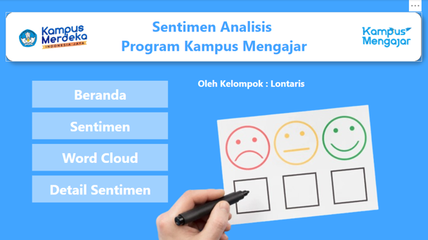
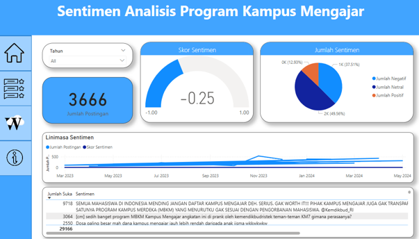
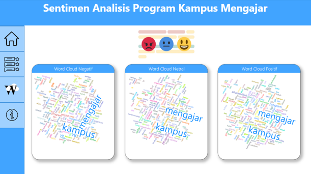
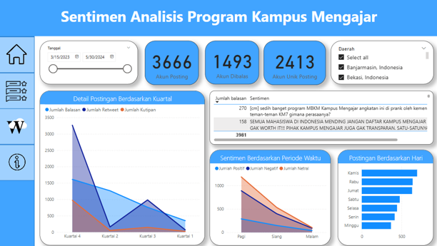

# CAPSTONE PROJECT - LONTARIS TEAM
MariBelajar Capstone Project

# 📊 Sentiment Analysis of the Kampus Mengajar Program

A Capstone Project developed during the **Certified Independent Study Program (MSIB Batch 6) 2024** at **PT MariBelajar Indonesia Cerdas**.

This project analyzes public sentiment toward the **Kampus Mengajar Program** using Twitter data. The system applies **Natural Language Processing (NLP)** techniques and a **TensorFlow** classification model to classify tweets into **Positive**, **Neutral**, and **Negative** sentiments. The results are presented through an interactive **Power BI Dashboard**, **This project was carried out over a period of 6 months, from January through the end of June**.

---

# 👥 Team Members

- **Bima Rahmadhani** — Universitas Teknokrat Indonesia
- Pande Gede Dani Wismagatha — Universitas Udayana
- Sandrina Ferani Aisyah Putri — Universitas Udayana
- Ni Luh Kristiani — Universitas Udayana

**Mentor**

Hesti Media Tama

---

# 📖 Background

The Kampus Mengajar Program is one of Indonesia's educational initiatives that encourages university students to contribute directly to schools.

To understand participants' opinions and public perception, this project performs **Sentiment Analysis** on Twitter data, enabling stakeholders to evaluate the program using data-driven insights.

---

# 🎯 Objectives

- Collect Twitter data related to Kampus Mengajar
- Perform text preprocessing
- Build a sentiment classification model
- Predict public sentiment
- Visualize sentiment results using Power BI
- Support decision-making through data analysis

---

# ✨ Features

## 📥 Data Collection

- Twitter Crawling
- Tweet Harvest
- Dataset Preparation

## 🧹 Text Preprocessing

- Case Folding
- Cleaning Text
- Remove URL
- Remove Mention
- Remove Hashtag
- Remove Number
- Remove Punctuation
- Tokenization
- Stopword Removal
- Stemming

## 🤖 Machine Learning

- TensorFlow
- Transfer Learning
- Sentiment Classification
- Model Evaluation

## 📊 Dashboard

- Overall Sentiment Score
- Sentiment Distribution
- Word Cloud
- Timeline Analysis
- Region Analysis
- Tweet Details
- Interactive Filters

---

# 🛠 Technologies Used

### Programming Language

- Python

### Machine Learning

- TensorFlow

### Natural Language Processing

- NLTK
- Sastrawi
- SpaCy
- InSet Lexicon

### Data Processing

- Pandas
- NumPy

### Visualization

- Power BI

### Data Source

- Twitter
- Tweet Harvest

---

# 🔄 Project Workflow

```text
Twitter Data
      │
      ▼
Data Collection
      │
      ▼
Text Preprocessing
      │
      ▼
Feature Extraction
      │
      ▼
TensorFlow Model
      │
      ▼
Sentiment Prediction
      │
      ▼
Power BI Dashboard
```

---

# 📂 Project Structure

```text
MariBelajar-Capstone-main
│
├── assets/
│   ├── workflow.png
│   ├── dashboard_home.png
│   ├── dashboard_sentiment.png
│   ├── dashboard_wordcloud.png
│   └── dashboard_detail.png
│
├── dashboard/
│   └── Sentiment_Analysis.pbix
│
├── data/
│   ├── raw/
│   ├── processed/
│   └── result/
│
├── model/
│
├── notebook/
│   ├── twitter_crawler.ipynb
│   ├── full_clean.ipynb
│   ├── model.ipynb
│   ├── after_model.ipynb
│   ├── tsv_converter.ipynb
│   └── kkn.ipynb
│
├── preprocessing/
│   ├── process.py
│   ├── reviewing.py
│   ├── removed_list.txt
│   └── removed_list_500_1000.txt
│
├── reports/
│   └── Capstone_Report.pdf
│
├── .gitignore
├── LICENSE
├── README.md
└── requirements.txt
```

---

# 📈 Dashboard Preview

## Home



---

## Sentiment Dashboard



---

## Word Cloud Dashboard



---

## Detail Dashboard



---

# 📊 Model Output

The system classifies tweets into:

- 😊 Positive
- 😐 Neutral
- 😞 Negative

Generated outputs include:

- Sentiment Prediction
- Word Cloud
- Sentiment Distribution
- Trend Analysis
- Dashboard Visualization

---

# 🚀 Installation

Clone the repository

```bash
git clone https://github.com/yourusername/MariBelajar-Capstone.git
```

Move to project directory

```bash
cd MariBelajar-Capstone
```

Install dependencies

```bash
pip install -r requirements.txt
```

---

# 📚 Learning Outcomes

This project demonstrates knowledge in:

- Natural Language Processing (NLP)
- Sentiment Analysis
- Machine Learning
- TensorFlow
- Data Cleaning
- Data Visualization
- Power BI Dashboard
- Python Programming

---

# 📄 Project Report

This repository is based on the Capstone Project completed during:

**MSIB Batch 6**

**PT MariBelajar Indonesia Cerdas**

---

# 👨‍💻 Authors

- Bima Rahmadhani
- Pande Gede Dani Wismagatha
- Sandrina Ferani Aisyah Putri
- Ni Luh Kristiani

---

# 📜 License

This project is licensed under the MIT License.

---

# ⭐ Support

If you find this project useful, please consider giving it a ⭐ on GitHub.
